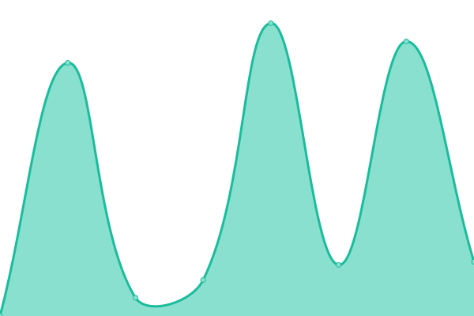

# [📈 Live Status](https://status.flky.dev): <!--live status--> **🟩 All systems operational**

This repository contains the open-source uptime monitor and status page for [flky.dev](https://flky.dev), powered by [Upptime](https://github.com/upptime/upptime).

With [Upptime](https://upptime.js.org), you can get your own unlimited and free uptime monitor and status page, powered entirely by a GitHub repository. We use [Issues](https://github.com/flky-dev/status.flky.dev/issues) as incident reports, [Actions](https://github.com/flky-dev/status.flky.dev/actions) as uptime monitors, and [Pages](https://status.flky.dev) for the status page.

<!--start: status pages-->
<!-- This summary is generated by Upptime (https://github.com/upptime/upptime) -->
<!-- Do not edit this manually, your changes will be overwritten -->
<!-- prettier-ignore -->
| URL | Status | History | Response Time | Uptime |
| --- | ------ | ------- | ------------- | ------ |
|  [Blog](https://blog.flky.dev) | 🟩 Up | [blog.yml](https://github.com/flky-dev/status.flky.dev/commits/HEAD/history/blog.yml) | 

 197ms
     
 | 

<a href="https://status.flky.dev/history/blog">100.00%</a>
    

|  [Social Media](https://social.flky.dev) | 🟩 Up | [social-media.yml](https://github.com/flky-dev/status.flky.dev/commits/HEAD/history/social-media.yml) | 

 198ms
     
 | 

<a href="https://status.flky.dev/history/social-media">100.00%</a>
    

|  [Link Shortener](https://s.flky.dev) | 🟩 Up | [link-shortener.yml](https://github.com/flky-dev/status.flky.dev/commits/HEAD/history/link-shortener.yml) | 

 533ms
     
 | 

<a href="https://status.flky.dev/history/link-shortener">99.62%</a>
    

|  [Analytics](https://analytics.flky.dev) | 🟩 Up | [analytics.yml](https://github.com/flky-dev/status.flky.dev/commits/HEAD/history/analytics.yml) | 

 576ms
     
 | 

<a href="https://status.flky.dev/history/analytics">100.00%</a>
    

|  [Content Delivery Network](https://cdn.flky.dev) | 🟩 Up | [content-delivery-network.yml](https://github.com/flky-dev/status.flky.dev/commits/HEAD/history/content-delivery-network.yml) | 

 173ms
     
 | 

<a href="https://status.flky.dev/history/content-delivery-network">100.00%</a>
    

<!--end: status pages-->

[**Visit our status website →**](https://status.flky.dev)

## 📄 License

- Powered by: [Upptime](https://github.com/upptime/upptime)
- Code: [MIT](./LICENSE) © [flky.dev](https://flky.dev)
- Data in the `./history` directory: [Open Database License](https://opendatacommons.org/licenses/odbl/1-0/)
